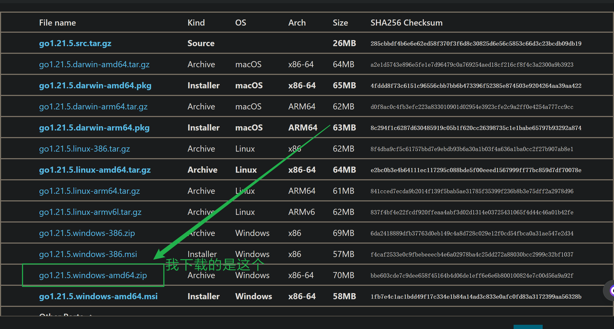
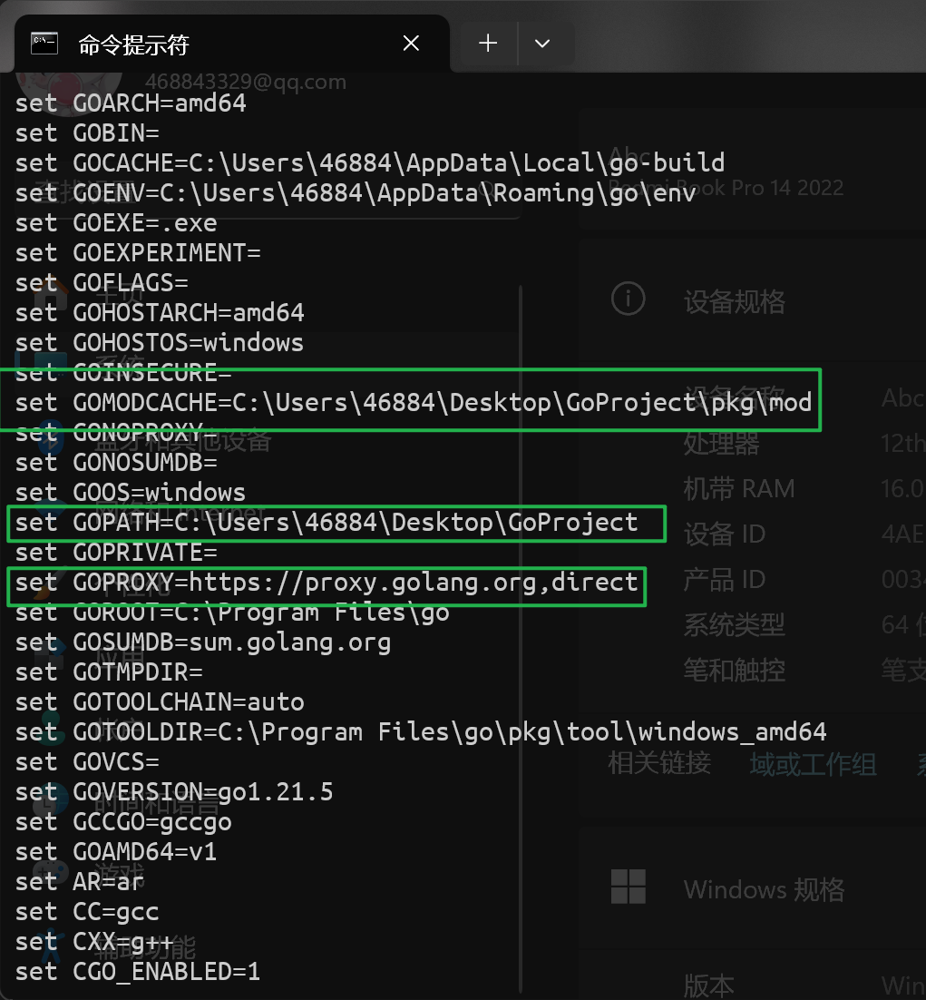
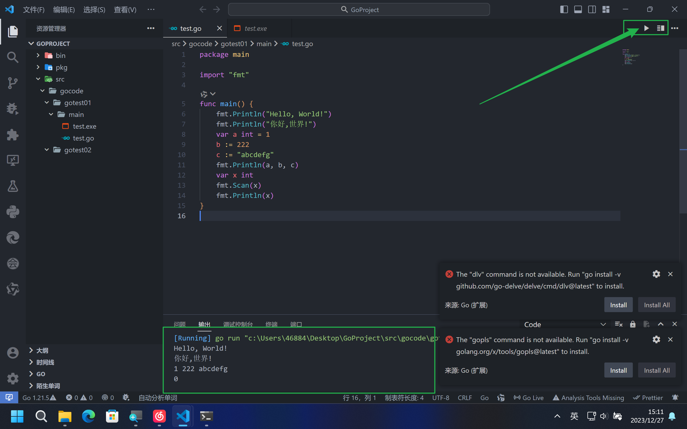

# Golang环境配置

## 1 环境配置

可以去Golang官网下载Golang的编译器：
<https://golang.google.cn/dl/>



我们要手动配置的环境变量有：

`GOROOT`：Golang编译器根目录。

`Path`：系统的 Path 环境变量。

`GOPATH`：Golang的工作空间的路径。

`GOPROXY`：Golang的网络代理。

*为避免误操作导致环境变量配置失败，建议在这四个环境变量配置完成之前不要关闭系统环境变量设置的窗口。*

### 1.1 GOROOT

如果你和我一样，下载的是压缩包，解压后复制编译器的根目录，作为环境变量`GOROOT`的变量。


就像下面这样，不要忘记点确定。


### 1.2 Path

接下来是Golang的`Path`环境变量，变量是Golang的`bin`目录。

用到的是`GOROOT`，即Golang的`Path`环境变量是`%GOROOT%\bin`


不要忘记，点确定。

### 1.3 GOPATH

接下来是`GOPATH`环境变量，即Golang的工作空间。

*如果你用 VS Code 配置过 C语言 ，你大概见过`${workspace}`，当然没见过也没关系。*

我们接着来配置我们的`GOPATH`环境变量。首先在一个你认为比较合适的地方建好你的工作空间文件夹。然后，复制你的工作空间文件夹的根目录的路径。


工作空间文件夹的结构可以是这样。


然后就是用我们的工作空间文件夹的根目录作为我们的`GOPATH`环境变量的变量了。

不要忘记，点确定。


### 1.4 GOPROXY

打开这个网站<https://goproxy.io/zh/>，选择你需要的部分作为你的`GOPROXY`的变量。

我用的是`https://goproxy.io,direct`


不要忘记，点确定。


配置好了之后，打开系统终端（cmd），输入命令`go env`后回车，查看Golang环境变量。



这三项就是我们之前配置的Golang的环境变量了。

诶，如果你要问我 “Path环境变量呢？”

嘿嘿，在你还没`Path`环境变量之前，如果你想要调用Golang的编译器 go.exe 你必须在终端使用`cd`命令cd到 go.exe 所在的文件夹才可以，而当你给 go.exe 所在的文件夹设置为环境变量`Path`的变量后，你就可以在任何目录（比如你的工作空间目录）调用你的 go.exe 了。就像下面这样：


## VS Code

事实上，你现在已经可以在系统终端或者VS Code的终端使用`go build`编译、`go run`编译运行你的Golang程序了。

但如果要使用VS Code中的一些功能，我们还需要做一些事情，而这里就用到了我们之前配置的`GOPROXY`环境变量了。

那就开始吧！

打开VS Code，在一个合适的地方创建一个Golang的源代码文件，并写一个简单的Golang测试代码。

```Golang
    package main

    import "fmt"

    func main() {
        fmt.Println("Hello, World!")
    }
```

如果你像以前一样直接按`F5`或者通过VS Code的功能运行它会弹出下面这个弹窗告诉你需要下载安装一些东西，而这就是通过你的环境变量`GOPROXY`中的变量下载的。

接下来的步骤建议打开梯子，因为要访问GitHub。

你可以直接点击`install`下载安装，也可以像我一样复制这段命令到终端中运行。

>go install -v golang.org/x/tools/gopls@latest


运行完了，你会发现在VS Code中，多了两个文件夹，这个名字看起来是不是很眼熟？

不熟？没关系，往下面看。


打开Golang的编译器根目录，这样是不是很眼熟了？


还有一些东西要下载安装，如果你再次同刚才的方法运行程序，又会出现一个提示。


也像之前一样，你可以直接点击`install`，或者复制提示中的命令在终端中运行。（建议打开梯子）

>go install -v github.com/go-delve/delve/cmd/dlv@latest


这样已经好了，现在再运行一下看看。



嘿嘿，这样就行了。

## Sublime Text

TODO

累了，有时间再搞。
